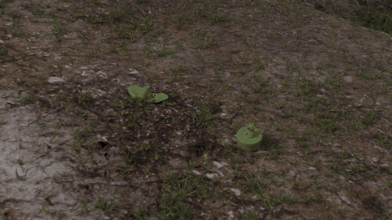
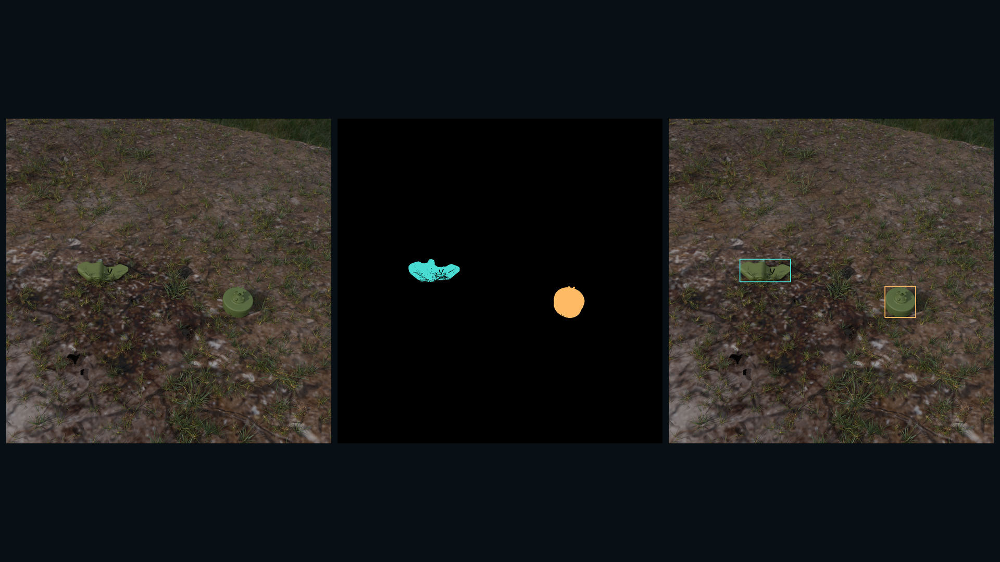
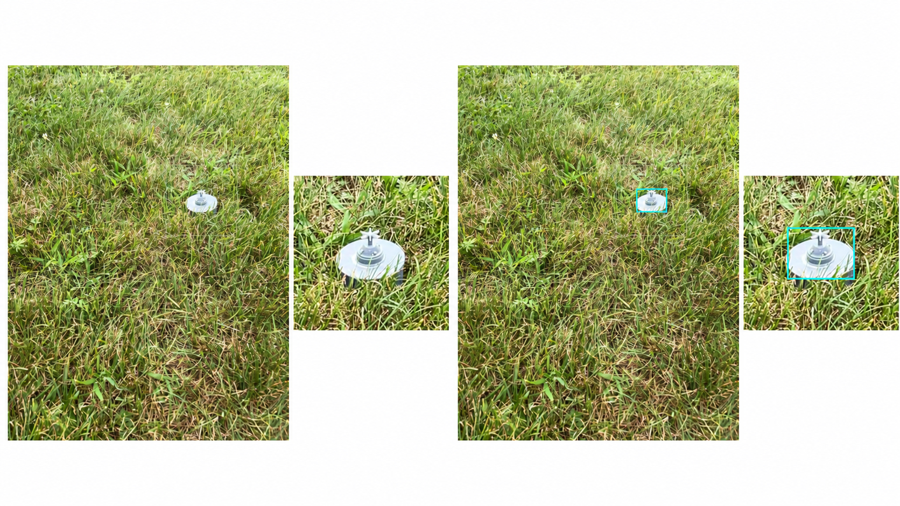
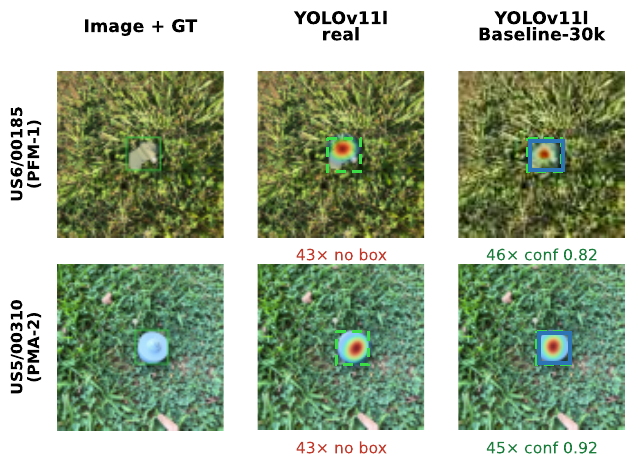

# [SSRR'26] Towards Replacing Real Images with Synthetic Data for Surface Landmine Detection

<p align="center">
  <a href="https://rma.ac.be/en"></a>&nbsp;&nbsp;&nbsp;
  <a href="https://www.kuleuven.be/english/"></a>&nbsp;&nbsp;&nbsp;
  <a href="https://www.ssrr-ieee.org/"></a>
</p>

<p align="center">
  
</p>

Code, released results, and download instructions for our Blender-based synthetic-data study of optical PFM-1 and PMA-2 detection. Models train on either real SULAND data or synthetic imagery and are evaluated on real **IID** (ITA test) and **OOD** (USA) splits.

## Paper highlights

All headline values below are from the current camera-ready manuscript (YOLO11l, 30k synthetic images unless noted). The real-training column uses the original real baseline without the additional appearance-adaptation stage; matched controls are reported immediately below.

| Result | Real training | Synthetic training |
|---|---:|---:|
| OOD macro-F1, confidence 0.25 | 0.348 | **0.751** (T-10) |
| OOD AP50 | 0.322 | **0.555** (T-10) |
| OOD mAP50–95 | 0.181 | **0.259** (T-10) |
| Five-seed OOD macro-F1 | 0.373 ± 0.026 | **0.738 ± 0.011** (Sun-Off) |

Every synthetic configuration exceeds the real baseline on OOD under macro-F1, AP50, and mAP50–95. On IID, the real baseline remains strongest under standard AP. A 2.6 M-parameter synthetic YOLO11n also exceeds the 25.3 M-parameter real-trained YOLO11l on OOD (0.613 vs. 0.348 macro-F1 at confidence 0.25).

### Additional control: appearance adaptation

A control retraining of the synthetic Baseline-30k YOLO11l with the synthetic-only appearance-adaptation stage disabled yielded an OOD macro-F1 of **0.465** at confidence 0.25 and AP50/mAP50–95 of **0.312/0.144**. The full synthetic pipeline obtains **0.727** and **0.545/0.244**, while the real-data YOLO11l obtains **0.348** and **0.322/0.181**. The control therefore shows that appearance adaptation materially contributes to sim-to-real transfer: without it, the synthetic model retains a fixed-threshold mF1 advantage, but not the standard-AP advantage. Compact metrics and curves are available under [`supplementary/appearance_adaptation_control/`](supplementary/appearance_adaptation_control/).

### Matched appearance-adaptation controls

| Training regime | mF1 @ 0.25 | AP50 | mAP50–95 |
|---|---:|---:|---:|
| Real baseline | 0.348 | 0.322 | 0.181 |
| Real + appearance adaptation | 0.601 | 0.477 | **0.275** |
| Synthetic Baseline-30k without adaptation | 0.465 | 0.312 | 0.144 |
| Synthetic Baseline-30k + adaptation | **0.727** | **0.545** | 0.244 |

To separate synthetic-data effects from the generic robustness provided by the appearance-adaptation stage, we additionally evaluated matched controls. Applying the same stage to real-data training substantially improves OOD robustness. Under matched adaptation, the synthetic Baseline-30k remains higher in OOD macro-F1 (0.727 vs. 0.601) and AP50 (0.545 vs. 0.477), while the adapted real model is higher in mAP50–95 (0.275 vs. 0.244). See [`supplementary/real_appearance_adaptation_control/`](supplementary/real_appearance_adaptation_control/) for metrics, curves, and reproduction material.

<p align="center">
  
  
</p>

## Reproduce in seconds (no GPU)

The evaluation CSVs are included. Regenerate the four paper result summaries and figures:

```bash
git clone https://github.com/mariomlz99/ssrr2026-photoreal-landmine.git
cd ssrr2026-photoreal-landmine
python -m venv .venv
source .venv/bin/activate
pip install -r requirements.txt
for script in analysis/make_results{1,2,3,4}_log.py; do python "$script"; done
```

Outputs appear in `results/`. The compact standard-AP results used in the paper are in [`eval_results/standard_ap/yolo11l_30k/summary.csv`](eval_results/standard_ap/yolo11l_30k/summary.csv).

## Full reproduction (GPU)

1. Follow [`DATA.md`](DATA.md) to place the synthetic datasets, SULAND, and optionally the released checkpoints.
2. Copy and edit the path template: `cp configs/env.example.sh configs/env.sh && source configs/env.sh`.
3. Run `bash reproduce_all.sh` for training → evaluation → analysis, or use the focused commands below.

```bash
# Main 14-configuration ablation
python training/train_ablation.py --models l --sizes 30k
python evaluation/eval_ablation_suland.py --size l --datasize 30k \
  --outdir eval_results/ablation_suland/yolo11l_30k

# Standard AP50 and mAP50–95 (released checkpoints required)
python evaluation/eval_standard_ap.py

# Five-seed robustness
bash variance_study.sh all
bash eval_variance.sh
```

All runs use 640×640 inputs, AdamW, 100 epochs, batch 32, seed 42, and the paper's fixed augmentation settings. Synthetic training additionally uses the documented appearance-adaptation pipeline. Standard AP evaluation remaps the reversed USA class IDs before invoking the Ultralytics validator.

<details>
<summary><strong>Repository map and advanced experiments</strong></summary>

| Path | Purpose |
|---|---|
| `training/` | real and synthetic YOLO11 training |
| `evaluation/` | fixed-confidence, IoU-sweep, and standard-AP evaluation |
| `analysis/` | table and figure builders |
| `eval_results/` | machine-readable released measurements |
| `results/` | generated paper summaries and plots |
| `configs/` | environment template and ablation definitions |
| `supplementary/` | reviewer-motivated controls and qualitative material not included in the 8-page paper |

Detector-scale and data-volume experiments:

```bash
python training/train_real_sizes.py --models n s
python training/train_ablation.py --models n s l --sizes 10k 20k 30k
```

The seed-42 tables use single runs. The uncertainty study repeats the real baseline and six informative synthetic configurations with seeds 42–46.

</details>

## Supplementary qualitative analysis

The final camera-ready paper omits the earlier HiResCAM figure for space and to keep the confidence/localization discussion appropriately cautious. The qualitative visualization is retained here as supplementary material.

<p align="center">
  
</p>

In the two selected OOD examples, the real-data and synthetic-trained models both concentrate attention on the target region, while only the synthetic-trained model produces a high-confidence detection. This visualization is **illustrative only** and is not presented as a calibration analysis or as evidence of a general causal mechanism. See [`supplementary/hirescam/README.md`](supplementary/hirescam/README.md) for details.

## Data and weights

- Synthetic datasets: 20 sets, approximately 439 GB ([download](https://ssrr-submission.s.gy/UFnfsN), SHA-256 `b5ecd78f4f4c161d65bbd478016842420820450ab38800cd0d97621522c849f8`).
- SULAND: obtain the benchmark from its original source; it is not redistributed here.
- Trained checkpoints: optional downloads and checksums are listed in [`DATA.md`](DATA.md).

Large datasets and checkpoints are intentionally kept out of Git. The repository contains only code, compact metrics, figures, and README media.

## Citation

Publication metadata is not final yet; please use the provisional citation below and check back for the DOI and page numbers.

```bibtex
@inproceedings{malizia2026replacing,
  title     = {Towards Replacing Real Images with Synthetic Data for Surface Landmine Detection},
  author    = {Malizia, Mario and Tsiogkas, Nikolaos and Demeester, Eric and Haelterman, Rob and Hasselmann, Ken},
  booktitle = {2026 IEEE International Symposium on Safety, Security, and Rescue Robotics (SSRR)},
  year      = {2026},
  note      = {Forthcoming}
}
```

## Acknowledgments

This work was supported by the Belgian Defence under Grant DAP 23/08. We thank the Graswald Team for granting permission to use [Gscatter](https://gscatter.com/) and their free assets for this research and its dissemination. OpenAI ChatGPT was used for language polishing and limited drafting assistance in parts of the manuscript; the scientific conception, methodology, analyses, interpretations, and conclusions remain the authors' own.

## License

Code is released under the [MIT License](LICENSE). External datasets, models, logos, and third-party assets remain subject to their respective terms.
